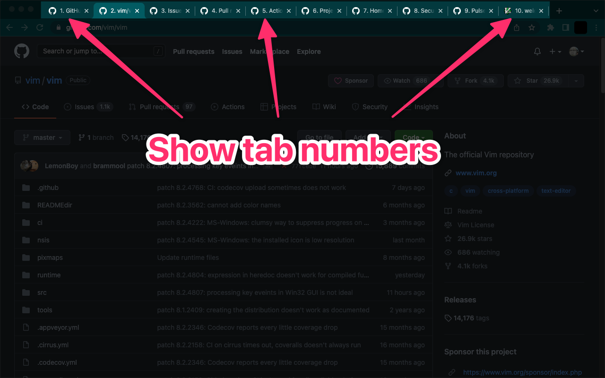

chrome-show-tab-numbers
==================================================

A Chromium extension to show tab numbers.

Notable features:

* This extension supports Google Chrome's collapsed tab group feature. Tabs belonging to a collapsed tab group are ignored.
* You can toggle tab numbering for all tabs or current tab via keyboard shortcuts or extension context menu.

How to Install
--------------------------------------------------

### From Chrome Web Store

https://chrome.google.com/webstore/detail/pflnpcinjbcfefgbejjfanemlgcfjbna

### From Source

1. Download and unzip this repository
1. Open the extensions of your browser
1. Enable "Developer mode"
1. Click "Load unpacked"
1. Select the downloaded directory

How to Develop
--------------------------------------------------

1. Clone this repository
1. Go to the cloned directory
1. Execute `npm install`
1. Create a branch
1. Edit source codes
1. Lint the source codes: `make lint`
1. (Fix lint errors and retry executing `make lint`)
1. Format the source codes: `make fix`
1. Create a pull request

How to Release
--------------------------------------------------

1. Update the version: `make update-major`, `make update-minor`, or `make update-patch`
   * Check a new release and its release notes on [Releases](https://github.com/kg8m/chrome-show-tab-numbers/releases)
1. Execute `make zip`
1. Upload the built zip file to [Chrome Web Store](https://chrome.google.com/webstore/devconsole) and publish it

Q&amp;A
--------------------------------------------------

### Q. Keyboard shortcuts don't work on Vivaldi; is this a bug in this extension?

A. No, it is Vivaldi's bug. As a workaround, changing the shortcut to `Global` will solve the issue.

cf. https://forum.vivaldi.net/topic/75247/extensions-keyboard-shortcuts-don-t-work/115

> That is a known issue that can be fixed by changing the shortcut from `In Vivaldi` to `Global`.
>
> This can have some side effects if you use the same shortcut in other programs, so it might be helpful to also take a look at this workaround: [https://forum.vivaldi.net/topic/69541/guide-make-extension-keyboard-shortcuts-work-windows-10-11](https://forum.vivaldi.net/topic/69541/guide-make-extension-keyboard-shortcuts-work-windows-10-11)

### Q. Tab number isn't shown if the tab is a PDF document; is this a bug in this extension?

A. No, it is a limitation. If the current page is a PDF, `document.title` returns `""` for a PDF document. So this extension is disabled for avoid unintentional loss of the title.
